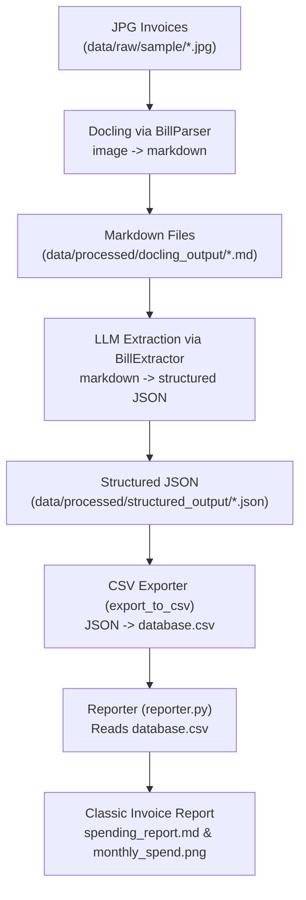

> **Editor's note:** This post is AI generated given the author prompts and design. It's based on a hands-on workshop where we built a real AI-powered pipeline live with students, using agents to co‑develop the system end‑to‑end. 

Invoices are one of those “boring but critical” artifacts every company produces. Hidden inside those JPGs and PDFs are patterns about cash flow, vendor risk, and operational efficiency — but most teams never see them, because the data is locked in pixels and scattered folders.

For this workshop, we turned that problem into a **mini automation project**: take a folder of raw invoice images, and turn them into **actionable financial insights** using an AI‑assisted development workflow in Cursor.

The result is a small but complete MVP:

- **Docling** turns invoice images into structured markdown.
- **OpenAI** extracts a typed `Bill` model from the markdown.
- A **CSV exporter** consolidates everything into `database.csv`.
- A **reporter layer** builds a monthly spending plot and a human‑readable Markdown report.

More importantly, the students didn’t just see the pipeline — they **co‑designed it with an AI agent**.

---

## Why build an invoice pipeline in a coding‑with‑agents workshop?

When you teach agent‑assisted coding, you want a project that:

- Has **clear business value** (finance teams love this).
- Is **small enough** to build in a few hours.
- Touches multiple layers: data, models, orchestration, reporting.
- Naturally showcases **automation workflows** and **LLM integration**.

An invoice pipeline checks all those boxes. It forces us to think like automation engineers:

- Where does the data come from?
- What are the intermediate artifacts?
- Where can AI add the most leverage without taking over the whole system?

In our case, we designed this flow (from `pipeline_flow.md`):



This is not a toy diagram: students watched the agent generate the files behind each box and refined them iteratively.

---

## Phase 1 – Automating the pipeline skeleton with Cursor

We started the workshop not by coding, but by **explaining to the agent what we wanted**:

- A `main.py` orchestrator.
- A `BillParser` for Docling.
- A `BillExtractor` using OpenAI.
- A `csv_exporter` module.
- A `reporter` module built on pandas + matplotlib.

Then we used Cursor’s agent mode to scaffold the project, refining the prompt until the skeleton matched our mental model.

A key teaching moment: **agents are great at wiring up boilerplate**, but we still own:

- The data contracts (our `Bill` model).
- The orchestration logic.
- Edge‑case handling.

Here is the heart of the orchestrator `main.py` that students saw early on:

```python
from pathlib import Path
from dotenv import load_dotenv

from src.parser import BillParser
from src.extractor import BillExtractor
from src.csv_exporter import export_to_csv

load_dotenv()

def main():
    base_dir = Path(__file__).parent
    raw_dir = base_dir / "data/raw/sample"
    docling_output_dir = base_dir / "data/processed/docling_output"
    final_output_dir = base_dir / "data/processed/structured_output"
    database_csv = base_dir / "data/processed/database.csv"
    model_csv = base_dir / "data/raw/data_model.csv"

    docling_output_dir.mkdir(parents=True, exist_ok=True)
    final_output_dir.mkdir(parents=True, exist_ok=True)

    bill_parser = BillParser()
    extractor = BillExtractor()

    input_files = list(raw_dir.glob("*.jpg"))

    for file_path in input_files:
        result = bill_parser.convert_image(file_path)
        markdown_content = bill_parser.export_markdown(result)

        md_path = docling_output_dir / f"{file_path.stem}.md"
        md_path.write_text(markdown_content, encoding="utf-8")

        bill = extractor.extract_data_from_markdown(markdown_content)
        bill.source_filename = file_path.name

        out_path = final_output_dir / f"{file_path.stem}.json"
        out_path.write_text(bill.model_dump_json(indent=2), encoding="utf-8")

    export_to_csv(final_output_dir, database_csv, model_csv)

if __name__ == "__main__":
    main()
```

Is it perfect? No. Is it **concrete, readable, and end‑to‑end**? Absolutely — and that’s exactly what you want in a workshop.

---

## Phase 2 – Using AI where it shines: semantic extraction with OpenAI

The star of the show is the `BillExtractor`, which converts markdown into a strongly‑typed `Bill` model using OpenAI’s **Structured Outputs**:

```python
from openai import OpenAI
from src.models import Bill

class BillExtractor:
    def __init__(self):
        api_key = os.getenv("OPENAI_API_KEY")
        if not api_key:
            raise ValueError("OPENAI_API_KEY environment variable is not set")
        self.client = OpenAI(api_key=api_key)

    def extract_data_from_markdown(self, markdown_text: str) -> Bill:
        prompt = (
            "You are an expert data extraction assistant. "
            "Extract the following information from the provided bill/invoice markdown text. "
            "Ensure all required fields are populated accurately based on the document content."
        )

        completion = self.client.beta.chat.completions.parse(
            model="gpt-4o-2024-08-06",
            messages=[
                {"role": "system", "content": prompt},
                {"role": "user", "content": markdown_text},
            ],
            response_format=Bill,
        )

        return completion.choices[0].message.parsed
```

In the workshop, we walked through a few key design choices:

- **Docling first, then LLM.** We don’t send images to the LLM directly. Instead, Docling converts layouts to markdown, which is cheaper and preserves structure (tables, labels, etc.).
- **Typed outputs, not JSON strings.** By using `response_format=Bill`, we avoid fragile regex/JSON parsing and land directly in a validated Pydantic model.
- **Automation‑friendly design.** The extractor is a pure function from markdown to a `Bill` instance. It’s trivial to parallelize or plug into other workflows.

This is where “AI as a component” becomes real: the LLM is **one step** in a deterministic pipeline, not the pipeline itself.

---

## Phase 3 – Turning JSON into a usable database

Once we had a folder full of structured JSON invoices, we needed something finance teams can actually work with: a consolidated CSV.

That’s the job of `csv_exporter.py`. The design goals:

- Respect a predefined **data model** (`data/raw/data_model.csv`).
- Avoid duplicate invoices on re‑runs.
- Stay explainable for students.

The core exporting logic looks like this:

```python
from pathlib import Path
from src.models import Bill

def export_to_csv(json_dir: Path, output_csv: Path, model_csv: Path) -> None:
    columns = get_column_order(model_csv)
    existing_filenames = get_existing_filenames(output_csv)
    json_files = list(json_dir.glob("*.json"))

    new_rows = []

    for json_file in json_files:
        data = json.loads(json_file.read_text(encoding="utf-8"))
        bill = Bill(**data)

        if bill.source_filename and bill.source_filename in existing_filenames:
            continue

        row = bill_to_row(bill, columns)
        new_rows.append(row)

        if bill.source_filename:
            existing_filenames.add(bill.source_filename)

    # Append or create CSV with a stable column order
    write_rows(output_csv, columns, new_rows)
```

For students, this phase reinforced a key idea: **automation workflows are pipelines of small, boring, reliable functions**. The glamour of LLMs still ends up in a CSV that can be opened in Excel.

---

## Phase 4 – Reporter layer: from numbers to narrative

The final piece of the workflow is the **reporter layer**, which turns `database.csv` into:

- A `monthly_spend.png` line chart.
- A human‑readable `spending_report.md` with:
  - Coverage period.
  - Total and average spend.
  - Top vendors.
  - Biggest invoices.

Under the hood, it’s “just” pandas and matplotlib:

```python
import pandas as pd

def load_database(csv_path: Path) -> pd.DataFrame:
    df = pd.read_csv(csv_path)
    df["issue_date"] = pd.to_datetime(df["issue_date"], errors="coerce")
    df = df.dropna(subset=["issue_date"])

    df["total_amount"] = pd.to_numeric(df["total_amount"], errors="coerce")
    df = df.dropna(subset=["total_amount"])
    return df

def compute_monthly_spend(df: pd.DataFrame) -> pd.DataFrame:
    df = df.copy()
    df["month"] = df["issue_date"].dt.to_period("M")
    monthly = (
        df.groupby("month", as_index=False)["total_amount"]
        .sum()
        .sort_values("month")
    )
    return monthly
```

We intentionally kept this layer **classic**: no LLMs, no magic. The AI did its job earlier by structuring the data. From here on, it’s solid, deterministic analytics.

This contrast is powerful in a workshop: students see when AI is the right tool, and when **good old pandas** is all you need.

---

## Teaching with agents: what students actually learned

Although the project is small, it unlocked several important lessons about working with agents in real‑world codebases:

- **Agents are collaborators, not magicians.** We used Cursor to:
  - Generate initial file skeletons.
  - Wire imports and CLI entry points.
  - Suggest refactors (e.g., separating reporter from pipeline).
  But we still made architectural decisions explicitly and iteratively.

- **Shape the API surface first.** Before asking for “implementation”, we fixed:
  - Entry points (`python main.py --limit 3`, `python -m src.reporter`).
  - Data contracts (`Bill` schema, CSV columns).
  - Directory layout (`data/raw`, `data/processed`, `reports`).

- **Automation is about composition.** The most powerful moment for students was running:

  ```bash
  python main.py --limit 3
  python -m src.reporter
  ```

  …and watching raw JPGs turn into a Markdown report and a plot, with **no manual steps in between**.

- **LLMs plus domain libraries beat LLMs alone.** Docling + OpenAI + pandas + matplotlib is far stronger (and cheaper) than trying to make an LLM do everything end‑to‑end.

---

## Where this mini‑MVP can go next

We wrapped up the workshop by brainstorming extensions:

- Adding **vendor risk scores** based on spending concentration.
- Plugging the CSV into a **BI dashboard** (Metabase, Superset, etc.).
- Replacing OpenAI with a **smaller open‑source model** once the schema is stable.
- Scheduling the pipeline as a **cron job** or using an orchestration tool.

But the core message to the students was simple:

> You don’t need a massive system to get real value from AI agents.  
> A well‑designed automation workflow, plus a few carefully placed AI steps, can already turn a messy folder of invoices into something your finance team will thank you for.

And if an agent helped you build it faster — even better.


